# Chapitre 0 : Introduction

>16 pts Exam
>4  pts 21 Avril
>Qcm  +1,0,-0.25

# Chapitre 1 : Préférences et choix

## 1.1 Problème de décision

**Problème de décision** : Un décideur fait face à un ensemble d’alternatives possibles ( mutuellement exclusives ) dans une situation donnée.

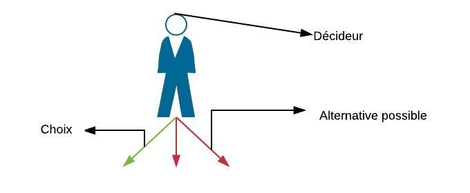

**Situation** : contraintes d'un choix.  
**Alternatives réalisables** : ensemble d'éléments d'une situation.  

## 1.2 Préférences (=goûts)

Les goûts de l'individu. Ces goûts peuvent être résumés par une relation de préférence.   
L'individu peut :  
- préférer strictement \>  
- être indifférent à un choix entre 2 choses. \~  
- préférer faiblement \>\~  

### Hypotheses fondamentales (préférences rationelles / cohérence )   

- *Toute paire d'alternatives peut être comparée*
> soit a\>\~b soit a\<\~ b soit a\>\~b et a\<\~b    
> relation complète   
> préférences complètes  

- *Si une alternative quelconque est au moins aussi désirable qu'une autre et cette autre au moins aussi désirable qu'une troisième, alors la première est au moins aussi désirable que la troisième*
> si a\>\~b et b\>\~c alors a>~c   
> Transitivite     
> relation de transitivité      

- *Toute Alternative est au moins aussi désirable qu'elle-même*
>  a \>\~ a    
> Réflexive  
> relation de réflexivité

Violation des hypothèses de  :   
- complétude : *paires incomparables*   
- transitivité : cas de *différences à peine perceptibles*    
- cadrage("framing") façon dont les choses sont *présentées*.   

> ces hypothèses sont si fondamentales que on peut les appeler axiomes ( ou axiomes de rationalité ou de cohérence )  

## 1.3 Utilité

Pour faciliter les analyses, nous alons synthétise les préférences au moyen d'une **fonction d'utilité**.( permets la numérotation(poids) et classement des alternatives )

> N.B. le seul but de cette fonction est de synthétiser les préférences

Exemple : u(a) \>= u(b) <\-\> a \>\~ b.
### Concept ordinal
L'utilité à pour seul vocation  de permettre d'ordonner, classer et comparer les différentes alternatives.
> N.B. il ne faut pas non plus interpréter les écarts entre les niveaux d'utilité

### Infinité
il existe une infinité de façon de transformer l'équation d'utilité.    
**u = f(u)** nous donne	la même	relation de préférence.

#### Existence
On ne peut pas toujours trouver une fonction d'utilité représentant la relation de préférences. Si nous pouvons, alors la fonction (ou relation ??) est dite complète et transitive.

## 1.4 Choix et Contraintes
Face à une situation décrite par un ensemble d'alternatives réalisables, l'individu va essayer de **maximiser ses préférences** en choisissant le **choix optimal**. On dit que l'individu **maximise son utilité sous contraintes.** Ses choix peuvent aussi être synthétisés sous la forme d'une fonction appelée **fonction de choix**. On parle d'**alternatives acceptables** quand l'individu pourrait être amené à choisir cet alternative au lieu d'une autre
> N.B. si il existe plusieurs alterntatives meilleures, alors l'individu sera indifférent entre elles

## 1.5 Préférences révélées
### Règle de choix
- Le concept de relation de préférence (mécanisme d'introspection) -> manipulation de l'information possible
- règle de choix : se base sur l'observation des choix de l'individu
> On parlera alors de **préférences révélées**  
> Ces préférences ne correspondent pas toujours aux véritables préférences.

### Axiome faible des préférences révélées
On s'attend à une certaine cohérence dans les choix observés.

### Principe des préférences révélées
Pour déterminer les préfénreces des individus en observant leur comportenment, nous devons supposer que les préférences restent inchangées au cours de la période d'observation. Cette hypothèse n'est pas réaliste si on considère des longues périodes. Nous allons donc estimer ces périodes à max 1 ou 3 mois en considérant que les gouts ne peuvent pas changer radicalmement en si peu de temps.

### Deux approches duales
- Préférences -> Choix (satisfait l'axiome faible des préférences révélées)
- Choix -> Préférences (elle peut être rationnalisée)

# Chapitre 2 : Consommation
## 2.1 Ensemble de consommation
### Panier de consommation
Un **panier de biens** ou **panier de consommation** est une liste de quantités des différents biens: x = (x1,x2,...,xn)
> on consière souvent que le panier n'est composé que de deux biens le bien 2 est le bien que le consommateur peux désirer acheter[*Bien Composite*]

### Ensemble de consommation
Les choix de consommation sont limités des contraintes physiques: la non négativité ou le fait qu'un bien soit **Discret** (*disponible uniquement en nombre entiers*)
**L'ensemble de consommation** est l'ensemble des paniers satisfaisant les contraintes physiques. (= Alternatives possibles)

## 2.2 Contraintes Budgétaire
à chaque panier on peut attribuer une **valeur**.  
La **contrainte budgéraire** sont les paniers accessibles ou abordables au prix des biens sur le marché comparativement aux revenus du consommateur.  
L'**ensemble budgétaire** sont l'ensemble des paniers qui appartiennent à l'ensemble de consommation et qui satisfont la contrainte budgétaire.  
La **droite de budget** et l'ensemble des paniers égaux à px=R (p:prix,x:panier,R:revenu).  

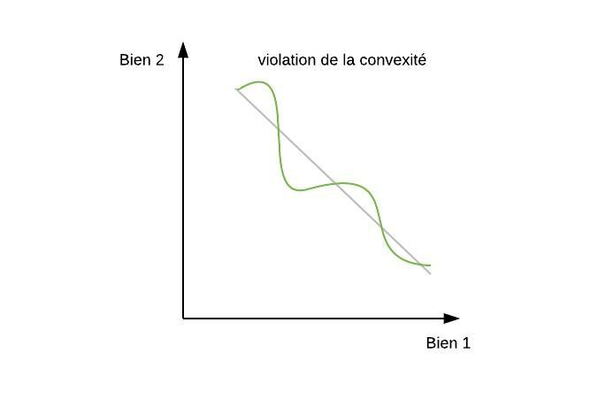
### Variations

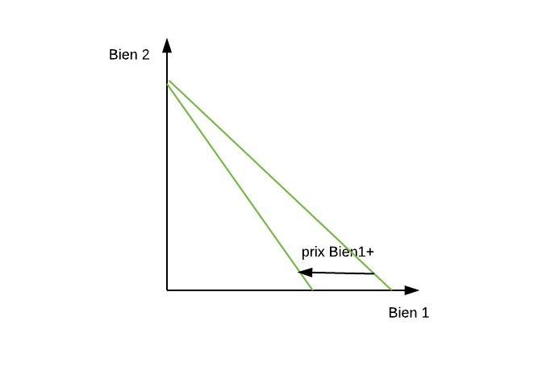
> L'inverse est aussi vrai. Et il en va de même pour le bien 2

## 2.3 Préférences
face à deux paniers, on peut les classer. ces classement peuvent se retranscrire sous la forme de **courbes d'indifférence**. Courbe sur laquelle le consommateur est indifférent.
- Elle indique les quantités nécéssaires pour compenser le consommateur "passant" d'un panier à un autre.
- elle n'indique  pas quels sont les paniers préférés et quels sont ceux qui sont moins désirables

> N.B. On peut en principe tracer une courbe d'indifférence à partir de n'importe quel panier

On peut donc être sur la courbe {yEX \| y\~ x}, dans le contour suppérieur {yEX \| y\>\~ x} ou dans le contour inférieur {yEX \| y\<\~ x}
### Hypotheses sur les préférences
Ces hypothèses ont un impact direct sur l'*allure des courbes*. Et si les préférences sont **classiques** (satisfont les Hypotheses), alors les courbes ont une **allure normale**.
- Toute paire peut être comparée(complétude)
- Si a\>\~b et b\>\~c alors a>~c  
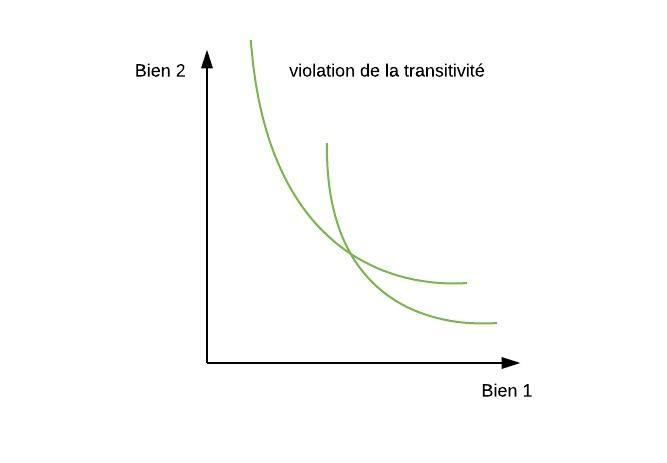
- Aucun petit changement n'inverse le classement entre 2 paniers
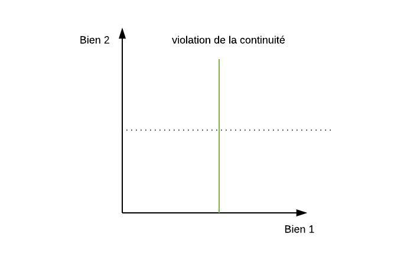
- Un panier contenant au moins autant de chaque bien est plus d'au moins un bien qu'un autre panier est préféré à celui-ci  (**Monotonicité**)
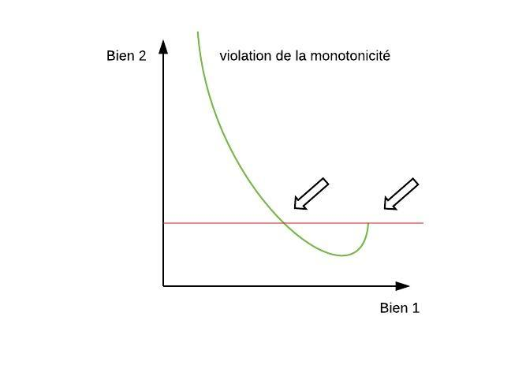
> L'hypothèse de Monotonicité exclut le phénomène de saturation ou satiété.   
Un **point de satiété** est un panier qui est préféré à tous les autres (graphique en cible).

- Les paniers intermédiaires sont préférés aux paniers extrêmes.   
On dit alors que la relation de préférence est une **relation convexe** et que les préférences sont **convexes**

### Types de biens
- bien désirable : l'individu préfère *consommer plus* de ce bien
- bien indésirable : l'individu préfère *consommer moins* de ce bien
- bien neutre : l'individu est indifférent à consommer plus ou moins de ce bien

## 2.4 Utilité
### Utilité et courbes d'indifférence
A partir d'une fonction d'utilité il est facile de tracer les courbes d'indifférence.
1. prendre un panier quelconque
2. trouver le y correspondant à ce panier avec la fct u
3. Tracer la courbe d'indifférence passant par x et la reliant tous ces points
4. Appliquer la même méthode un autre panier

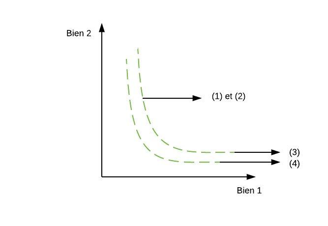

### Hypothèses
Rappel : les préférences qui peuvent être représentées en fonction d'utilité sont complètes, transitives et continues

### Utilité marginale
//??
### Taux marginal de substitution (TmS(x))
Le **taux marginal de substitution** est le taux auquel le consommateur accepte de substituer le bien 2 au bien 1.
> Ce taux est le rapport des unités marginales des biens considérés.
> Son signe algébrique est négatif. Souvent, par convention, on utilise la valeur absolue de ce ratio.

**La pente de la courbe d'indifférence** mesurée en n'importe quel point est égale au taux auquel le consommateur désire substituer un bien à un autre en ce point

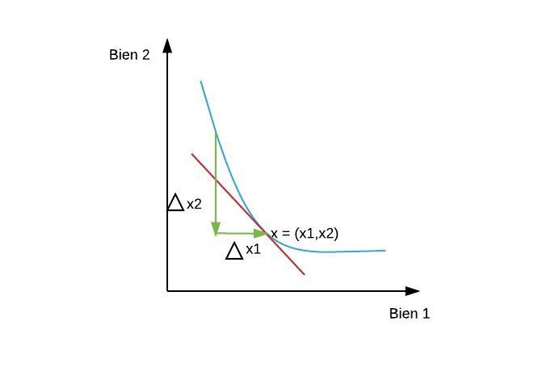

### Exemples de fonctions d'utilité
- Substituts parfaits
Le consommateur ne se préoccupe que de la quantité totale de biens.

- Compléments parfaits
Le consommateur ne se préoccupe que de la quantité minimale de biens.

- Préférences Cobb-Douglas
L'exemple classique des courbes d'indifférence dites d'allure normale.

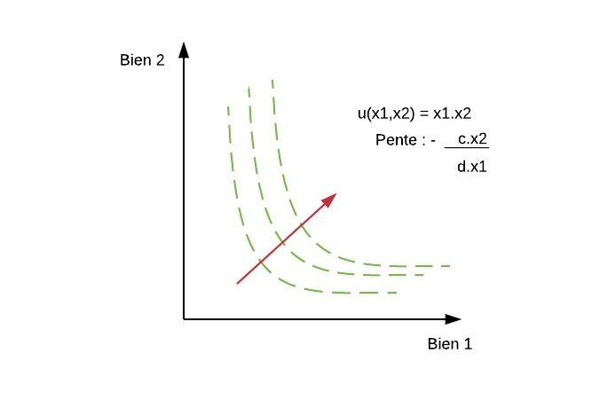

## 2.5 Demande individuelle
p : **prix** des biens sur le marché    
R : **revenu** du consommateur    
x* : **quantité optimale des biens** (paniers demandés par le consommateur)  
>si p et R bougent, alors x* aussi

**La fonction de demande** : fonction qui relie le choix optimal(x*) aux valeurs des prix et des revenus. ( = *Quantité demandée* , *Fonction de demande individuelle* )

Dans le cas de n biens x*=f(p,R)=(f1(p,R),...,fn(p,R))

Le panier optimal se situe au point de tangence entre la courbe d'indifférence et la droite du budget.

**La courbe d'indifférence ne peut jamais couper la droite de budget**

u -> préférence du consommateur  
u(x*) > u(x)  
TmS(x*) = -p1/p2

|TmS(z)>p1/p2| *on doit descendre sur la droite.  
|TmS(z)<p1/p2| *on doit monter sur la droite.

### Propriétés de la demande individuelle
1. Continuité : La continuité de la relation de préférence assure la continuité de la fonction de demande.
2. Homogénéité : L'invariance de la contrainte budgétairepar rapport à l'unité de compte choisie.
3. Loi de Warlas : La monotonicité de la relation de préférence assure l'identité budgétaire.
4. Unicité : La convexité stricte de la relation de préférence implique l'unicité de la solution.

### Solution
Dans le cas d'une solution intérieure, le choix optimal satisfait deux propriétés:
- L'égaliation du taux marginal de substitution et du rapport des prix
- L'identité budgetaire

Dans le cas de deux biens, le problème de maximisation sous contraintes s'écrit comme suit :

**p1x1 + p2x2 = R**

//## 1.6 Préférences révélées
//## 1.7 Statique comparative
//## 1.8 Demande agrégée
//## 1.9 Demande inverse

# Chapitre 3 : Incertitude et temps

## 3.1 L'objet du choix
**Action** : Objet du choix d'un individu dans un univers incertain.  
**conséquences** : résultats d'actions.
**état du monde** / **état de nature** : Il s'agit de la réalisation de l'événement qui détermine la conséquence qu'à une action.  

L'individu qui prend des décisions les prends en incertitude.(X univers certain).

**consommations contingentes** / **consommations conditionnelles** / **perspectives conditionnelles de consommation** : description de ce qui sera consommé dans les différents états de la nature.

**Loterie** : distribution de probabilité sur un ensemble de résultats ou lots possibles.

L=(π1, ... , πn)

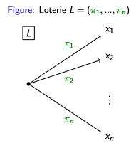

**loterie simple** : deux résultats possibles.
**loterie dégénérée** : si un résultat à une probabilité = 1
**loterie composée** : si il existe au moins un résultat qui est une loterie non dégénérée.

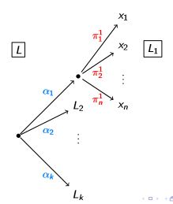

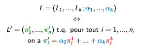

Une loterie non composée peut s'écrire comme une combinaison de loterie simples

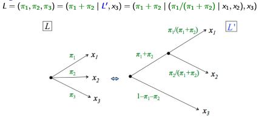

### Généralisation
**variable aléatoire** : résultat d'une action que l'individu peut choisir
**fonction de distribution** : caractérisation des variables aléatoires
la distribution de probabilité associé peut être résumée par ses **moments** :
- sa **moyenne** ou **espérance(mathématique)**
- sa **variance**

## 3.2 Préférences
### Préférences sur les loteries
Un individu peut classer les loteries.   
> Postulat conséquantialiste :  seule la distribution de probabilité sur les résultats possibles certains a de l'importance et dès lors, l'individu est indifférent entre toute loterie produisant cette distribution composée ou non.

### Hypothèses sur les préférences
1. Complétude
2. Transitivité
3. Continuité
4. Indépendance

## 3.3 Utilité espérée
L'utilité d'une loterie est égale à la somme pondérée d'une fonction du résultat de chaque état.

U(L) = Somme(de i=1 à n) $π$i.v(xi)
> xi est le résultat i qui se réalise avec probabilité $π*i

**Forme d'utilité espérée** / **forme d'utilité attendue** : ce que la fonction d'utilité admet alors

fonction d'utilité dans ce cas est une **fonction d'utilité espérée** / **fonctionn d'utilité attendue** / **fonction d'utilité Von Neumann - Morgenstern**

On dit aussi que la fonction d'utilité possède la **propriété de l'espérance de l'utilité** / **propriété de l'utilité espérée** / **propriété de l'utilité attendue**

### Utilité espérée et choix
Le décideur choisira la meilleure loterie en fonction de ses préférences. Si il souhaite maximiser ses préférences, alors il maximisera l'utilité espéré des lots qui la compose.

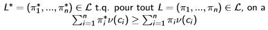

### Concept cardinal
La propriété d'utilité cardinale est une propriété cardinale. càd : elle permets don, en plus du signe, de récupérer la grandeur d'écart entre les valeurs

### Existance et limites
*Théorème de l'espérance de l'utilité (von Neuwmann - Morgenstern)* : si les préférences sont continues et indépendantes, alors il existe une fonction d'utilité représenant ces préférences qui possède la propriété de l'utilité espérée.

### Unicité à une transformation affine près
Toute transformation monotone d'une fonction d'utilité exprime les mêmes préférences mais ne possède pas forcément les mêmes propriétés de l'utilité espérée. Si on conserve les propriétés de l'utilité espérée, alors on a une **transformation affine positive**

F(U) est une **transformation affine positive** et F(U) = $Alpha$U + $Beta$ avec $Alpha$ > 0

> On dit alors qu'une fonction d'utilité espérée est unique à une transformation près.

## 3.4 Aversion au risque
Aversion : Espérance de la loterie >= loterie 
Goût : Espérance de la loterie <= loterie 

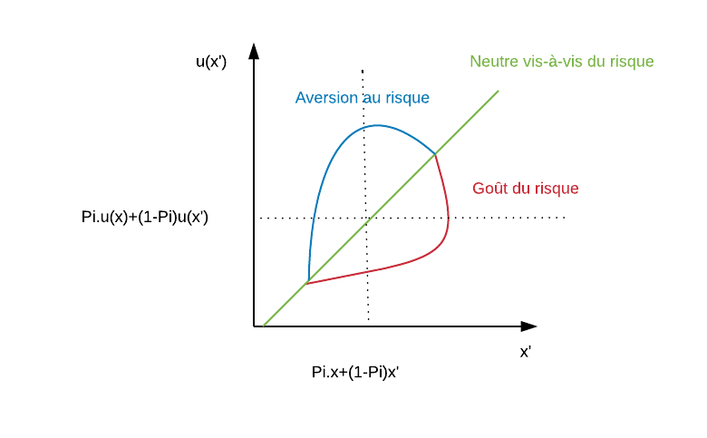

> On fait l'hypothèse décroissante avec la richesse
 
Concavité stricte : u''(x) < 0
convexité stricte : u''(x) >0

On peut avoir une aversion au risque sur des petits montents
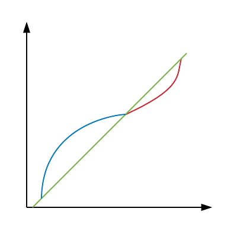

On peut mesurer le **degré d'aversion au risque**  = coëf d'aversion absolue pour le risque 
Mu(x) = -u''(x) /u(x)

aussi appelé **coef d'arrow-Pratt**

### Modèle moyenne-variance
Ce modèle suppose que les préférences ne dépendent que de **la moyenne** et de **la variance**.
**L'utilité** est une *distribution des probabilités*. u(µ,£²) ou (µ,1/£²)

1/£² est appelé **précision** 
> £ = *Ro*

Pour une aversion au risque, les décideurs vont préférer, une moyenne + élevée et une variance plus faible ( = précision + élevée)

Cette approche est utilisée dans le choix d'un portefeuille financier. Les actifs -> (moyenne et variance) et donc par niveau d'utilité, ce qui permets de les classer par la suite.

### Limites de l'appoche
La variance seule ne suffit pas à caractériser le risque. il faut tenir compte des moments d'ordre >2

## 3.5 Applications

### Application 1 : Demande d'assurance
#### Du point de vue du demandeur d'assurance
Un individu à une richesse **W0**, il peut perdre **S** avec une probabilité **π**  

Pour assurer ce patrimoine, il veut couvrir avec le niveau **x**, et sa prime est égale à **&x**

On suppose que le décideur à une aversion au risque. Son choix optimal est donc **l'assurance complète**

- Si il y a sinistre : w1(x) = (w0 - s - &x +x)
- Si il n'y a pas de sinistre : w2(x) = (w0 - &x)

On va donc tenter de maximiser l'équation suivante :  *π.u(w0-S-&x+x) + (1-π).u(w-&x)*

On obtient donc la fonction suivante : 

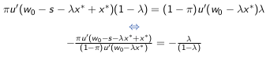

#### Du point de vue de la compagnie d'assurance 
elle perçoit &x peut importe le sinistre ou non. Donc son profit espéré est donc de *&x-(πx-(1-π))* *<=>* *&x-πx*. On fait ici l'hypothèse que la compagnie  ne fait en moyennne pas de profits, ni de perte. La prime d'assurance sera dite **actuariellement équitable** et donc *& = π*.

Au final, par l'hypothèse d'aversion au risque on obtient : **w0-s-&x* +x* = w0 -&x***  <=> **x* = s**
La solution du problème de demande d'assurance consiste donc à **couvrir totalement le risque**

### Application 2 : Précaution 
#### Un individu neutre vis à vis du risque 
La somme x est ce qu'il est prêt à payer au plus pour réduire la probabilité de π à (π-ε). Dans le cas ou l'individu est neutre vis à vis du risque, alors u(m) = m et x* =εs.
La solution est donc de **payer le gain espéré de la réduction de la probabilité du risque**. 
> on se fiche de π et de w

### Application 3 : Choix de portefeuille
Un individu doit choisir entre un actif risqué et un actif à rendement variable R sur une distribution F. Il inverstira x dans l'actif 
cet individu a une aversion au risque. 
On choisira l'actif risqué quand le rendement espéré dépasse le rendement de l'actif certain.

### Application 4 : Risk pooling
on a ici le cas de deux personnes qui ont chaqu'un un revenu aléatoire. doivent ils mettre leurs ressources en commun et puis diviser par 2? OUI
 
## 3.6 Epargne

On va diviser le temps en t en T intervales (t=1 est le présent et t=T est l'**horizon décisionnel (infini)** ).
### Valeurs présentes et futures
**R1** est un montant sur un compte qui rapporte un interêt **r**. On peut en déduire la valeur présente ou valeur actualisée d'une somme Rt: Rt = (1+r)^(t-1) .R1

